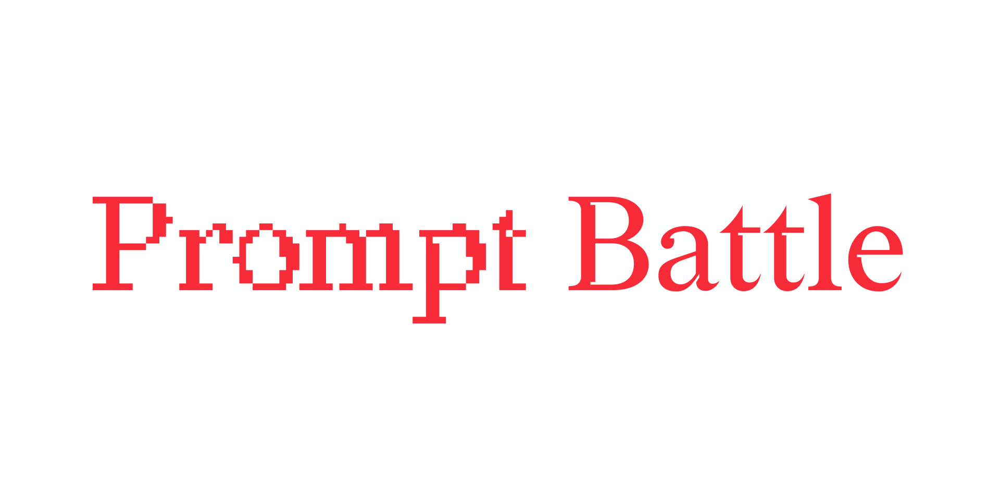

# The Promp Slam Interface

> Battle each other in an amazing prompt slam using the power of DALL-E.

A Prompt Slam (also known as a prompt battle) is an event format invented by [Florian A. Schmidt](https://florianalexanderschmidt.de/) and [Sebastian Schmieg](https://sebastianschmieg.com/) with design students from the [HTW Dresden](https://www.htw-dresden.de/).

During a Prompt Slam people compete against each other using text-to-image AI models. The audience then chooses one of the contestants as a winner.
For an independent Prompt Slam event series, hosted at [HfK Bremen](https://www.hfk2020.de/), this interface was developed.

You can read more about the original Prompt Slam [here](https://promptbattle.com/).

## 📝 Colophon

- Fonts in use:
  - [Redaction](https://www.redaction.us/) by [Jeremy Mickel](https://mckltypeq.com/)
  - [Helvetica](https://www.linotype.com/de/1308886/helvetica-schriftfamilie.html) by Max Miedinger and Eduard Hoffmann
- Technology:
  - Built with [SvelteKit](https://kit.svelte.dev/)
  - Made beautiful with [Tailwind CSS](https://tailwindcss.com/)
  - Complemented with carefully crafted icons from [Tabler Icons](https://tabler.io/docs/icons/svelte)
  - Uses the [Open AI API](https://platform.openai.com/) to talk to [DALL·E 2](https://openai.com/product/dall-e-2)

## 🎲 How to play

### Gamemode: One vs. One

In this gamemode two contestants play against each other simultaneously.
In the beginning they will both get an instruction on what they need to generate. They then have one minutes to simultaneously create a prompt.
after that one minute is over, they both click 'Generate' to generate an image.

The crowd then decides which of the contestant has generated the better image and that constestant goes to the next round.

### Other Gamemodes

Other gamemodes are currently developed and will be added to this repo in the future.

## 💻 Use this interface

To use this interface you only need API access to the [OpenAI API](https://openai.com/product).

Replace `YOUR_OPENAI_API_KEY` in the `.env.example` file with your OpenAI API key. Then rename the `.env.example` to `.env`.

You can then either host the interface locally or deploy it to the hosting provider of your choice.

## 🚧 Development

Once you've created a project and installed dependencies with `npm install` (or `pnpm install` or `yarn`), start a development server:

```bash
npm run dev

# or start the server and open the app in a new browser tab
npm run dev -- --open
```

## 🏗️ Build for production

To create a production version of your app:

```bash
npm run build
```

You can preview the production build with `npm run preview`.

> To deploy your app, you may need to install an [adapter](https://kit.svelte.dev/docs/adapters) for your target environment.

To start the production build use:

```bash
node build/index.js
```

This starts the interface as a node.js app.

## 🐳 Deploy with Docker

Using the Dockerfile in this repository, you can also deploy the app as a Docker container.

First, build the Docker image. Make sure to have add an OpenAPI Key to the `.env` file and adjust the ORIGIN variable before building the the image.

```bash
docker build . -t prompt-slam
```

Then start the created Docker image as a container.

```bash
docker run -d -p 3000:3000 prompt-slam
```
